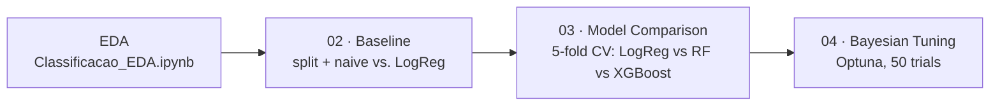

# 🚦 Predicting Fatal Traffic Accidents on Brazil's Federal Highways

**93% accuracy. Zero fatal accidents detected.**

That's not a bug — it's what happens when you point a naive model at real, messy, *brutally* imbalanced government data and trust the wrong metric. This project digs into 73,156 real traffic accidents reported by Brazil's Federal Highway Police (PRF) in 2024 and asks a harder question: can we actually flag the ~7% of accidents that turn fatal, before accuracy fools us into thinking we're done?

If you care about imbalanced classification, data leakage traps, or watching a model go from "useless" to "actually useful" across four notebooks — keep reading.


---

## ⚠️ The Accuracy Trap

Before touching a single hyperparameter, the very first model in this project — a `DummyClassifier` that always predicts "no fatality" — already scores **93% accuracy**. It also has an F1-score of **0.00** on the class that actually matters. It never once flags a fatal accident, and accuracy doesn't even notice.

| Model | F1 (fatal class) | Recall | Precision | ROC-AUC |
|---|---|---|---|---|
| Dummy (always predicts "no fatality") | 0.00 | 0.00 | 0.00 | — |
| Baseline — Logistic Regression | 0.32 | 0.72 | 0.21 | 0.833 |
| XGBoost (default hyperparameters) | 0.36 | 0.58 | 0.26 | 0.818 |
| **XGBoost + Bayesian tuning (Optuna)** | **0.38** | 0.51 | 0.31 | **0.835** |

This table is the whole story of the project in one glance — and every row is a notebook.

---

## 📊 The Dataset at a Glance

| | |
|---|---|
| **Source** | [Portal Brasileiro de Dados Abertos](https://dados.gov.br/dataset/acidentes-rodovias-federais) — official PRF (Federal Highway Police) accident records |
| **Size** | 73,156 accidents, 31 raw columns |
| **Target** | `com_vitima_fatal` — did the accident have at least one fatality? |
| **Class balance** | 92.86% no fatality vs. **7.14% fatal** (~13:1 imbalance) |
| **Data quality** | 0 duplicate rows, nulls confined to 4 low-impact columns (<0.2% of rows) |

The target is engineered from the original 3-class `classificacao_acidente` column, binarized deterministically *before* the train/test split (no leakage risk — it's a fixed string-to-int mapping, not a fitted transformation).

**A leakage trap worth knowing about:** the raw data includes `mortos` (death count), which correlates **0.81** with the target — because the target is literally derived from it. Columns like `mortos`, `feridos*`, `ilesos` and `classificacao_acidente` are dropped from every feature set (see [`src/data.py`](src/data.py)) — using them would mean predicting the outcome from the outcome.

---

## 🧭 Project Pipeline

Four notebooks, each with one job — no notebook does EDA *and* modeling *and* tuning:



| Notebook | What it does | Key takeaway |
|---|---|---|
| [`Classificacao_EDA.ipynb`](notebooks/Classificacao_EDA.ipynb) | Data quality, distributions, correlations — exploration only, no modeling | `mortos` leaks the target; numeric features alone barely correlate with it |
| [`02_Preprocessamento_Baseline.ipynb`](notebooks/02_Preprocessamento_Baseline.ipynb) | Train/test split *before* any transformation, dummy baseline vs. Logistic Regression | `class_weight='balanced'` turns 0.00 recall into 0.72 |
| [`03_Comparacao_Modelos.ipynb`](notebooks/03_Comparacao_Modelos.ipynb) | Stratified 5-fold CV across LogReg, RandomForest, XGBoost | RandomForest hits 93% accuracy but **F1 = 0.098** — the accuracy trap strikes again, even with class weighting |
| [`04_Otimizacao_Optuna.ipynb`](notebooks/04_Otimizacao_Optuna.ipynb) | Bayesian hyperparameter search (TPE sampler, 50 trials, F1-optimized) | +10% F1 over default XGBoost, just from tuning |

Shared data loading, leakage-safe feature selection and preprocessing live in [`src/data.py`](src/data.py) so all four notebooks stay consistent and DRY.

---

## 🏆 Results & What They Mean

The tuned XGBoost model — found by Optuna after 50 trials optimizing F1 via cross-validation — settles on:

```
n_estimators=600, max_depth=10, learning_rate=0.053,
subsample=0.63, colsample_bytree=0.52, min_child_weight=5
```

It reaches the best F1 (0.38) *and* the best ROC-AUC (0.835) of the whole pipeline — but notice its recall (0.51) is actually the **lowest** of the three real models. Since ROC-AUC (threshold-independent) is its best score too, this points to a model that ranks accidents better overall, just evaluated at a default 0.5 threshold that isn't necessarily the right operating point. Tuning that decision threshold — not just the model — is next on the list (see [Roadmap](#️-roadmap)).

Every trained model is saved to `models/*.joblib`; every chart (confusion matrices, ROC curves, CV comparisons, Optuna's optimization history and parameter importances) is saved to `reports/*.png` when you run the notebooks yourself.

---

## 📁 Project Structure

```
├── data/         raw dataset (gitignored — see setup below)
├── notebooks/    the 4-notebook pipeline described above
├── src/          shared, reusable code (data loading, preprocessing)
├── models/       trained models (.joblib, gitignored)
├── reports/      generated charts (.png, gitignored)
└── requirements.txt
```

Source code is versioned; data, trained models and generated charts are not — they're regenerated by running the notebooks.

---

## 🚀 Getting Started

```bash
# 1. Clone and enter the project
git clone <this-repo-url>
cd Classificacao

# 2. Create and activate a virtual environment
python -m venv venv
.\venv\Scripts\Activate.ps1      # Windows
# source venv/bin/activate       # macOS/Linux

# 3. Install dependencies
pip install -r requirements.txt
```

**Get the data** — the raw CSV isn't versioned (it's a few dozen MB). Download the 2024 "accidents grouped by occurrence" file from the [PRF Open Data page](https://www.gov.br/prf/pt-br/acesso-a-informacao/dados-abertos/dados-abertos-da-prf) (also catalogued on [dados.gov.br](https://dados.gov.br/dataset/acidentes-rodovias-federais)) and place it at:

```
data/datatran2024.csv
```

Then open the notebooks in order — `Classificacao_EDA.ipynb` → `02` → `03` → `04` — and run them top to bottom.

---

## 🗺️ Roadmap

- [ ] Tune the decision threshold instead of defaulting to 0.5 (precision-recall trade-off analysis)
- [ ] Try CatBoost and LightGBM (already in `requirements.txt`, not yet in the comparison notebook)
- [ ] SHAP values for feature-level explainability
- [ ] Package the final model behind a minimal prediction API

---

## 📄 Data Attribution

Accident data is public and produced by the **Polícia Rodoviária Federal (PRF)**, distributed via the [Portal Brasileiro de Dados Abertos](https://dados.gov.br/dataset/acidentes-rodovias-federais) under Brazil's open data policy.

---

## 🙋 Questions or Ideas?

Open an issue — feedback on the modeling choices, the leakage handling, or the threshold trade-off discussion is very welcome.
