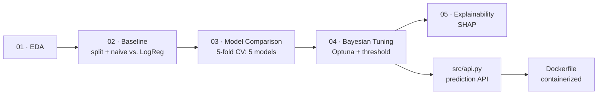

# 🚦 Predicting Fatal Traffic Accidents on Brazil's Federal Highways

**93% accuracy. Zero fatal accidents detected.**

That's not a bug — it's what happens when you point a naive model at real, messy, *brutally* imbalanced government data and trust the wrong metric. This project digs into 73,156 real traffic accidents reported by Brazil's Federal Highway Police (PRF) in 2024 and asks a harder question: can we actually flag the ~7% of accidents that turn fatal, before accuracy fools us into thinking we're done?

If you care about imbalanced classification, data leakage traps, or watching a model go from "useless" to "actually useful" across a full pipeline — keep reading.


---

## ⚠️ The Accuracy Trap

Before touching a single hyperparameter, the very first model in this project — a `DummyClassifier` that always predicts "no fatality" — already scores **93% accuracy**. It also has an F1-score of **0.00** on the class that actually matters. It never once flags a fatal accident, and accuracy doesn't even notice.

| Model | F1 (fatal class) | Recall | Precision | ROC-AUC |
|---|---|---|---|---|
| Dummy (always predicts "no fatality") | 0.00 | 0.00 | 0.00 | — |
| Baseline — Logistic Regression | 0.32 | 0.72 | 0.21 | 0.833 |
| XGBoost + Optuna (default 0.5 threshold) | 0.38 | 0.51 | 0.31 | 0.835 |
| **XGBoost + Optuna (tuned decision threshold)** | **0.39** | 0.46 | 0.35 | **0.835** |

This table is the whole story of the project in one glance — and every row is a notebook.

---

## 📊 The Dataset at a Glance

| | |
|---|---|
| **Source** | [Portal Brasileiro de Dados Abertos](https://dados.gov.br/dataset/acidentes-rodovias-federais) — official PRF (Federal Highway Police) accident records |
| **Size** | 73,156 accidents, 31 raw columns |
| **Target** | `com_vitima_fatal` — did the accident have at least one fatality? |
| **Class balance** | 92.86% no fatality vs. **7.14% fatal** (~13:1 imbalance) |
| **Data quality** | 0 duplicate rows, nulls confined to 4 low-impact columns (<0.2% of rows) |

The target is engineered from the original 3-class `classificacao_acidente` column, binarized deterministically *before* the train/test split (no leakage risk — it's a fixed string-to-int mapping, not a fitted transformation).

**A leakage trap worth knowing about:** the raw data includes `mortos` (death count), which correlates **0.81** with the target — because the target is literally derived from it. Columns like `mortos`, `feridos*`, `ilesos` and `classificacao_acidente` are dropped from every feature set (see [`src/data.py`](src/data.py)) — using them would mean predicting the outcome from the outcome.

---

## 🧭 Project Pipeline

Five notebooks plus a containerized prediction API, each with one job — no notebook does EDA *and* modeling *and* tuning:



| Notebook | What it does | Key takeaway |
|---|---|---|
| [`01_Classificacao_EDA.ipynb`](notebooks/01_Classificacao_EDA.ipynb) | Data quality, distributions, correlations — exploration only, no modeling | `mortos` leaks the target; numeric features alone barely correlate with it |
| [`02_Preprocessamento_Baseline.ipynb`](notebooks/02_Preprocessamento_Baseline.ipynb) | Train/test split *before* any transformation, dummy baseline vs. Logistic Regression | `class_weight='balanced'` turns 0.00 recall into 0.72 |
| [`03_Comparacao_Modelos.ipynb`](notebooks/03_Comparacao_Modelos.ipynb) | Stratified 5-fold CV across LogReg, RandomForest, XGBoost, CatBoost, LightGBM | RandomForest hits 93% accuracy but **F1 = 0.098** — the accuracy trap strikes again, even with class weighting |
| [`04_Otimizacao_Optuna.ipynb`](notebooks/04_Otimizacao_Optuna.ipynb) | Bayesian hyperparameter search (TPE sampler, 50 trials, F1-optimized) + decision-threshold tuning | +10% F1 from tuning, another ~4% from picking the right threshold instead of the default 0.5 |
| [`05_Explicabilidade_SHAP.ipynb`](notebooks/05_Explicabilidade_SHAP.ipynb) | Global + local feature importance with SHAP | Accident type (head-on collisions, pedestrian hits) and party count dominate — and a subtle bug trap: densifying the sparse one-hot matrix silently corrupts predictions |

Shared data loading, leakage-safe feature selection and preprocessing live in [`src/data.py`](src/data.py) so every notebook stays consistent and DRY.

---

## 🏆 Results & What They Mean

Five models were compared with stratified 5-fold CV: **LogReg, RandomForest, XGBoost, CatBoost and LightGBM**. The three gradient-boosting models land close together on F1 (0.349–0.355); CatBoost and LightGBM actually edge out XGBoost on ROC-AUC (0.830 / 0.829 vs. 0.809), but XGBoost wins on F1 — the metric this project optimizes for — so it moves on to tuning.

The tuned XGBoost model — found by Optuna after 50 trials optimizing F1 via cross-validation — settles on:

```
n_estimators=600, max_depth=10, learning_rate=0.053,
subsample=0.63, colsample_bytree=0.52, min_child_weight=5
```

It reaches the best F1 (0.38) *and* the best ROC-AUC (0.835) of the whole pipeline at the default 0.5 threshold — but notice its recall (0.51) is actually the **lowest** of the models so far. ROC-AUC (threshold-independent) being its best score too points to a model that ranks accidents better overall, just evaluated at a threshold that isn't the right operating point. Sweeping the precision-recall curve and picking the F1-optimal threshold (~0.585 instead of 0.5) pushes F1 to **~0.39** — precision improves, recall drops further, because F1-optimal treats both errors as equally costly. That's not necessarily what you want in this domain (missing a fatal accident vs. a false alarm are not equally bad), which is exactly why the notebook shows the full precision-recall trade-off table instead of just the "optimal" point.

SHAP confirms the model is picking up real signal, not noise: accident type (head-on collisions and pedestrian strikes push hardest toward "fatal"; rear-end collisions push the other way), party count (`pessoas`, `veiculos`), location, and time of day (early morning is riskier than daytime) dominate the feature importance ranking — all consistent with real-world road safety knowledge.

Every trained model is saved to `models/*.joblib`, the tuned decision threshold to `models/limiar_otimo.json`; every chart (confusion matrices, ROC and precision-recall curves, CV comparisons, Optuna's optimization history, SHAP plots) is saved to `reports/*.png` when you run the notebooks yourself.

---

## 📁 Project Structure

```
├── data/                   raw dataset (gitignored — see setup below)
├── notebooks/              the 5-notebook pipeline described above
├── src/                    shared, reusable code (data loading, preprocessing, prediction API)
├── models/                 trained models + tuned threshold (.joblib / .json, gitignored)
├── reports/                generated charts (.png, gitignored)
├── Dockerfile              container recipe for the prediction API
├── requirements.txt        full environment (notebooks + API)
└── requirements-api.txt    slim, version-pinned environment for the container
```

Source code is versioned; data, trained models and generated charts are not — they're regenerated by running the notebooks.

---

## 🚀 Getting Started

```bash
# 1. Clone and enter the project
git clone <this-repo-url>
cd Classificacao

# 2. Create and activate a virtual environment
python -m venv venv
.\venv\Scripts\Activate.ps1      # Windows
# source venv/bin/activate       # macOS/Linux

# 3. Install dependencies
pip install -r requirements.txt
```

**Get the data** — the raw CSV isn't versioned (it's a few dozen MB). Download the 2024 "accidents grouped by occurrence" file from the [PRF Open Data page](https://www.gov.br/prf/pt-br/acesso-a-informacao/dados-abertos/dados-abertos-da-prf) (also catalogued on [dados.gov.br](https://dados.gov.br/dataset/acidentes-rodovias-federais)) and place it at:

```
data/datatran2024.csv
```

Then open the notebooks in order — `01` → `02` → `03` → `04` → `05` — and run them top to bottom.

**Serve the final model** — once `04_Otimizacao_Optuna.ipynb` has run (so `models/modelo_final_optuna.joblib` and `models/limiar_otimo.json` exist), start the prediction API:

```bash
uvicorn src.api:app --reload
```

Then open `http://127.0.0.1:8000/docs` for interactive Swagger docs, or call it directly:

```bash
curl -X POST http://127.0.0.1:8000/predict \
  -H "Content-Type: application/json" \
  -d '{
    "dia_semana": "segunda-feira", "uf": "SP", "br": 101,
    "causa_acidente": "Velocidade Incompatível", "tipo_acidente": "Colisão traseira",
    "fase_dia": "Plena Noite", "sentido_via": "Crescente", "condicao_metereologica": "Céu Claro",
    "tipo_pista": "Simples", "tracado_via": "Reta", "uso_solo": "Rural",
    "pessoas": 2, "veiculos": 2, "latitude": -15.7801, "longitude": -47.9292, "hora": 14
  }'
```

**Or skip the environment setup entirely and run the API in Docker** — no Python, no virtualenv, no dependency conflicts, same result on any machine:

```bash
docker build -t fatal-accident-api .
docker run -p 8000:8000 fatal-accident-api
```

Then hit `http://localhost:8000/docs` exactly as above. The image only needs `models/modelo_final_optuna.joblib` and `models/limiar_otimo.json` to already exist (generated by running the notebooks once) — it doesn't retrain anything, it just serves.

Two things worth knowing about [`Dockerfile`](Dockerfile) if you're reading it as a reference:
- It installs from [`requirements-api.txt`](requirements-api.txt), not the full `requirements.txt` — the container never touches Jupyter, Optuna, SHAP or the other training-only tools, only what's needed to load a model and answer requests.
- Every version in that file is **pinned to match exactly what trained the saved model** (scikit-learn 1.4.0, XGBoost 2.0.3, pandas 2.2.2). Building without pins the first time round quietly installed newer libraries and threw `InconsistentVersionWarning: ... might lead to breaking code or invalid results` — the predictions happened to still come out right, but "happened to" isn't something to ship. Pinning fixed it, and shrank the image by ~260MB as a bonus, since the newer XGBoost build pulls in a 342MB NVIDIA GPU library nothing here uses.

---

## 🗺️ Roadmap

- [x] Tune the decision threshold instead of defaulting to 0.5 (precision-recall trade-off analysis)
- [x] Try CatBoost and LightGBM in the comparison notebook
- [x] SHAP values for feature-level explainability
- [x] Package the final model behind a minimal prediction API
- [x] Containerize the API (Dockerfile) for easier deployment

**What's next:**
- [ ] Add automated tests for `src/data.py` and `src/api.py`
- [ ] Try resampling strategies (SMOTE, undersampling) as an alternative to `class_weight='balanced'`
- [ ] Model calibration (`CalibratedClassifierCV`) — SHAP and threshold tuning both assume the predicted probabilities are meaningful, worth verifying

---

## 📄 Data Attribution

Accident data is public and produced by the **Polícia Rodoviária Federal (PRF)**, distributed via the [Portal Brasileiro de Dados Abertos](https://dados.gov.br/dataset/acidentes-rodovias-federais) under Brazil's open data policy.

---

## 🙋 Questions or Ideas?

Open an issue — feedback on the modeling choices, the leakage handling, or the threshold trade-off discussion is very welcome.
